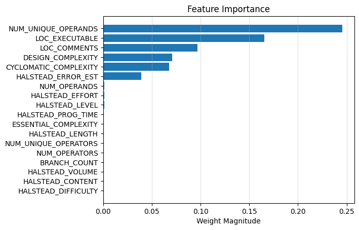

# Software Defect Prediction

This project asks a narrower question than “how accurately can we predict bugs?”: **which static code metrics carry useful defect signal, and what can those metrics actually tell us?**

Mason Azzopardi and I compared sparse logistic regression with a small fully connected neural network across two public defect datasets. We used model weights as an exploratory feature-selection tool, while treating them as associations—not evidence that a metric causes or prevents defects.

## Study design

| Dataset | Samples used | Metrics | Experiments |
| --- | ---: | ---: | --- |
| NASA PROMISE, JM1 subset | 7,720 modules | 18 after removing three redundant LOC fields | Custom weighted, L1-regularized logistic regression |
| GitHub Pull Request (GHPR) baseline | 6,052 examples | 21 CK code metrics | L1 logistic regression and a two-hidden-layer neural network |

Both experiments use stratified 80/20 train/test splits. Inputs are standardized from statistics learned on the training set. The PROMISE experiment also applies `log(1 + x)` before standardization to reduce the skew in its count-based metrics.

### Sparse logistic regression

The logistic-regression implementation is written directly with NumPy gradient descent. For PROMISE, false negatives receive four times the gradient weight of negative examples because the experiment deliberately values finding defective modules over avoiding every false alarm. L1 regularization encourages small coefficients to converge toward zero, making the remaining weights easier to inspect.

### Neural-network comparison

The PyTorch baseline for GHPR uses layers of 21 → 32 → 16 → 1, ReLU activations, 50% dropout, binary cross-entropy, and stochastic gradient descent. Its purpose is to compare the sparse linear model with a modest nonlinear classifier, not to claim a state-of-the-art result.

## Results

The results below belong to different datasets and should not be compared as though they came from one shared test set.

### PROMISE JM1

The weighted logistic model's saved test confusion matrix contains 787 true negatives, 435 false positives, 110 false negatives, and 212 true positives. That is **64.70% accuracy** and **65.84% recall for defective modules** on this split. The relatively high false-positive count is consistent with the intentional four-to-one false-negative weighting.

Six coefficients remained above the report's `0.01` exploratory importance threshold:

| Static metric | Coefficient magnitude | Direction in this model |
| --- | ---: | --- |
| Unique operands | 0.2456 | Higher predicted defect probability |
| Executable lines of code | 0.1657 | Higher |
| Lines of comments | 0.0970 | Higher |
| Design complexity | 0.0709 | Higher |
| Cyclomatic complexity | 0.0679 | Higher |
| Halstead error estimate | 0.0393 | Higher |

These weights identify relationships in JM1 after this preprocessing and regularization scheme. They do not establish, for example, that comments introduce defects; comment count may instead track module size or difficult code.



### GHPR

On the checked-in split, the logistic-regression experiment reports **71.68% accuracy**. Its largest coefficient magnitudes are number of static invocations, inheritance depth, coupling between objects, response for a class, and lines of code.

The current notebook output records **75.31% accuracy** for the neural network. The accompanying report records 75.64% from a separate run; because the network training is stochastic and the notebook does not fix its random seeds, the saved runs differ slightly.

| Logistic-regression feature weights | Neural-network first-layer weights |
| --- | --- |
|  |  |

## What we took from it

- Static size, complexity, vocabulary, and coupling measures contain useful signal in these datasets.
- A coefficient is conditional on the dataset, preprocessing, correlated features, model, and chosen threshold; it is not a universal ranking of engineering practices.
- Static metrics cannot see semantic mistakes that leave the program's shape unchanged, such as an off-by-one loop boundary. That creates an information limit no classifier can solve from these inputs alone.
- Accuracy is incomplete for an imbalanced defect dataset. The PROMISE confusion matrix makes the cost tradeoff more legible than the headline percentage alone.

The practical conclusion is modest: static metrics can help focus review and testing, but they should not be treated as direct quality targets or substitutes for understanding program behavior.

## What I worked on

This was a two-person study. I prepared the PROMISE datasets, wrote the ARFF-to-CSV conversion script, implemented the weighted sparse logistic-regression experiment, and contributed to the analysis and report. Mason led the GHPR and neural-network experiments, and we co-authored the final write-up.

## Reproduce the notebook

The converted datasets and saved notebook outputs are committed. To rerun the analysis from the repository root:

```bash
python3 -m venv .venv
source .venv/bin/activate
python -m pip install numpy pandas matplotlib seaborn scikit-learn scipy torch jupyter
jupyter lab model.ipynb
```

To regenerate the PROMISE CSV files from the committed ARFF sources:

```bash
python dataset/process_data.py
```

The repository does not currently pin dependency versions. Rerunning the neural network can also produce slightly different results unless random seeds are added.

## Repository guide

```text
.
├── model.ipynb             Data preparation, models, evaluation, and plots
├── dataset/                PROMISE and GHPR data plus the conversion script
├── log-regression-figures/ Saved PROMISE figures
└── Latex_Proposal/         Paper source and GHPR result figures
```

## Authors

- Aidan Goodyer
- Mason Azzopardi
